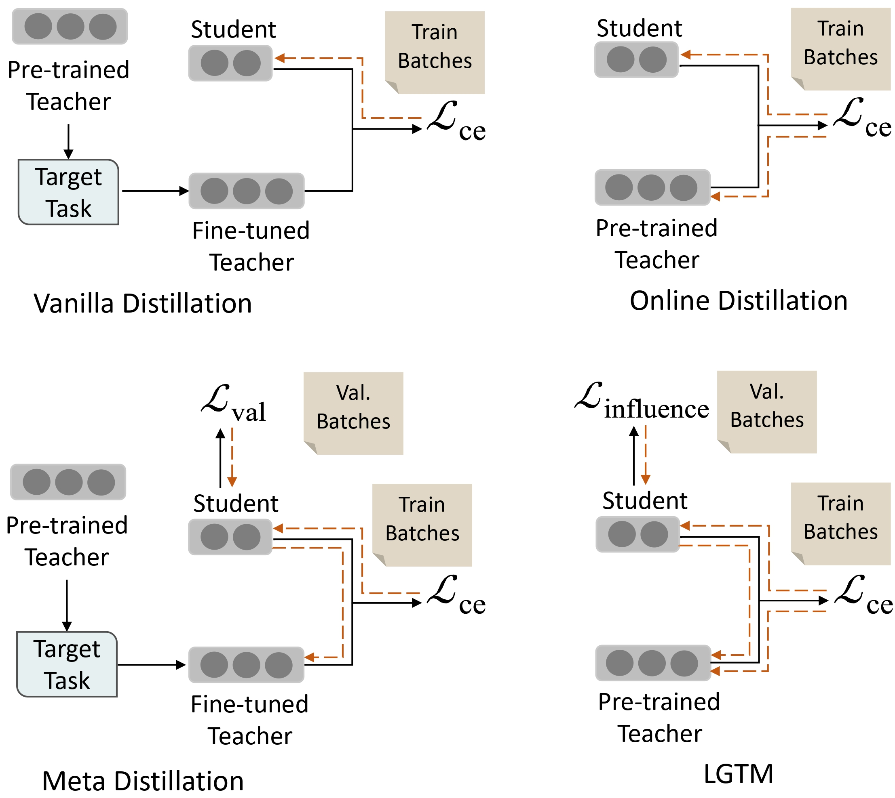
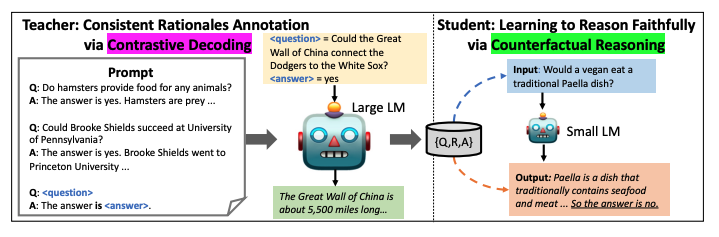

# UROP
- NLP
- Knowledge Distillation

 

## 🏃🏻‍♀️ Schedule
- 연구계획서 제출 : 23-09-15 
- 연구보고서 제출 : 23-12-15

 

## 📘 Document

| Summary | Title & Authors | Introduction | Links | 
|:----|  :----: | :---:| :---:|
| [#1 LGTM](https://velog.io/@yun_haaaa/%EB%85%BC%EB%AC%B8-%EC%9D%BD%EA%B8%B0-1-LGTM) | [Tailoring Instructions to Student's Learning Levels Boosts Knowledge Distillation](https://arxiv.org/abs/2305.09651)   Yuxin Ren, Zihan Zhong, Xingjian Shi, Yi Zhu, Chun Yuan, Mu Li | |[Github](https://github.com/twinkle0331/LGTM)   [Paper](https://arxiv.org/abs/2305.09651) |
| [#2 SCOTT](https://velog.io/@yun_haaaa/%EB%85%BC%EB%AC%B8-%EC%9D%BD%EA%B8%B0-2-SCOTT-Self-Consistent-Chain-of-Thought-Distillation)| [SCOTT: Self-Consistent Chain-of-Thought Distillation](https://arxiv.org/abs/2305.01879)   Peifeng Wang, Zhengyang Wang, Zheng Li, Yifan Gao, Bing Yin, Xiang Ren | |[Paper](https://arxiv.org/abs/2305.01879) |

 

## 👊🏻 Troubleshooting

 

## ✏️ Report

 

## 💬 Meeting

 
